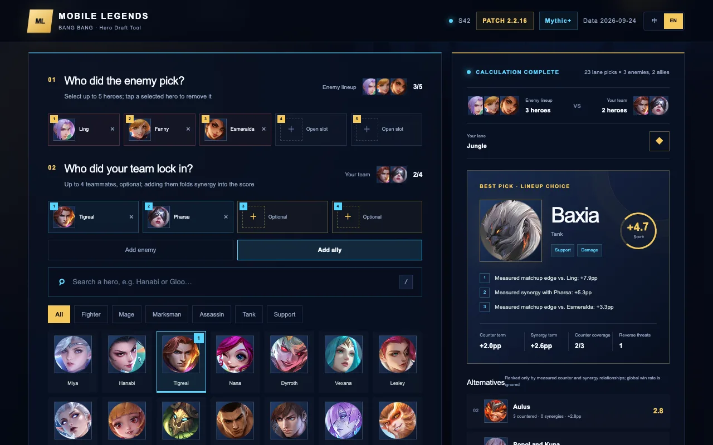
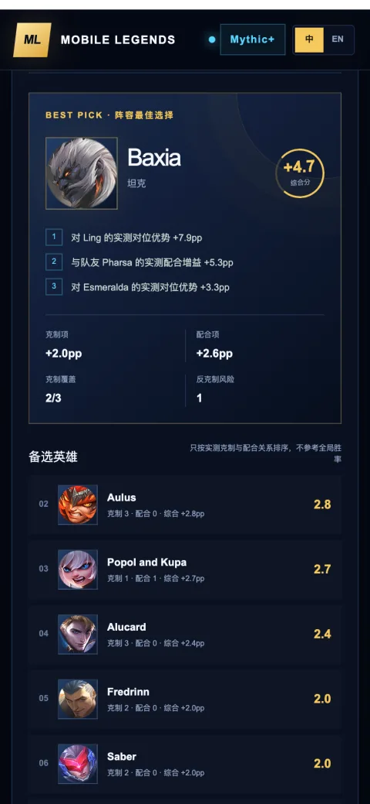
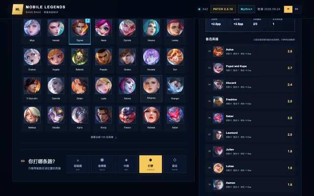

<div align="center">

# Counter Ready · 决胜巅峰克制助手

**Know the enemy lineup, pick the right hero.** A bilingual Mobile Legends: Bang Bang draft assistant that scores counters and teammate synergy together.<br>
**看清敌我，选对英雄。** 中英双语的《决胜巅峰》选英雄工具，同时计算克制关系和队友配合。

<a href="https://guigulaoshi.github.io/counter-ready-mlbb/"></a>

**[▶ Play it now / 在线使用](https://guigulaoshi.github.io/counter-ready-mlbb/)** — runs in the browser, nothing to install / 打开网页即可使用，无需安装。

<a href="https://guigulaoshi.github.io/counter-ready-mlbb/"></a>

</div>

> A fast, bilingual Mobile Legends: Bang Bang (国服《决胜巅峰》) draft assistant that scores counters against the enemy lineup and synergy with your own team, powered by a local Mythic+ statistics snapshot.

一个快速、中英双语的《决胜巅峰》（Mobile Legends: Bang Bang）选英雄工具：同时计算对敌方的克制关系和与队友的配合关系，使用本地神话+统计快照。

## Screenshots / 截图

<table>
  <tr>
    <td width="33%"></td>
    <td width="33%"></td>
    <td width="33%"></td>
  </tr>
  <tr>
    <td align="center">Phone, 中文 / 手机首页</td>
    <td align="center">Enemy + ally picks / 选敌方和队友</td>
    <td align="center">Best pick and why / 最佳选择和理由</td>
  </tr>
  <tr>
    <td colspan="3"></td>
  </tr>
  <tr>
    <td colspan="3" align="center">Desktop, 中文: lane picker and ranked alternatives / 电脑版：分路选择与备选英雄排名</td>
  </tr>
</table>

<sub>Screenshots taken from the live site. / 截图均取自线上网页。</sub>

## Play / 在线使用

<https://guigulaoshi.github.io/counter-ready-mlbb/>

The site is static and works on desktop and phone browsers. No install, no account.

网页版为静态页面，电脑和手机浏览器都能直接打开，无需安装、无需账户。

## Features / 功能

- Select 1–5 enemy heroes and up to 4 locked-in teammates / 选择 1–5 名敌方英雄，以及最多 4 名已确定的队友
- Filter recommendations by EXP, Gold, Mid, Jungle or Roam / 按五个分路筛选
- Rank picks only by measured Mythic+ counter and synergy relationships; global win rate is ignored / 只按神话+实测的克制与配合关系排序，不考虑全局胜率
- Automatically follows the browser language, with a manual 中文/EN switch / 根据浏览器语言自动选择中英文，也可手动切换
- Responsive desktop and mobile layouts / 同时适配桌面和手机
- No account, backend or user-tracking features / 无需账户、后端或用户追踪

## Scoring / 计分方式

```
score = mean(counter edge vs. each enemy) + mean(synergy edge with each teammate)
分数 = 对每名敌方的克制值取平均 + 对每名队友的配合值取平均
```

Both terms are measured win-rate swings in percentage points, so they add directly. Means rather than sums keep the two terms weighted the same way no matter how many enemies or teammates are locked in so far.

两项都是实测胜率增减的百分点，因此可以直接相加。取平均而非求和，是为了让两项的权重不随已选人数变化而漂移。

Counter edges are signed: the reverse direction (the enemy countering your pick) subtracts. Synergy edges are only ever positive, because the source publishes each hero's best partners and never its worst — an unlisted pair counts as 0, not as a penalty.

克制值有正有负：被敌方反克制会扣分。配合值只有正值，因为数据源只公布每位英雄的头部搭档、不公布最差搭档——没有列出的组合按 0 处理，而不是扣分。

## Data / 数据

- Patch 2.2.16 · Season 42
- Snapshot / 快照：2026-09-24
- 133 heroes / 133 位英雄
- 6,899 counter edges and 944 synergy pairs / 6,899 条克制关系和 944 对配合关系
- Win, pick and ban rates are the 7-day average across Mythic and Mythical Honor / 胜率、选取率、禁用率为神话、神话荣耀近 7 日平均值
- Counter edges come from the mlbb.tools JSON API; synergy edges are read from each hero's "Best With" block / 克制数据来自 mlbb.tools 的 JSON 接口，配合数据来自英雄页的 "Best With" 区块
- Mythical Glory is excluded: its samples are thin enough that pair edges reach 40–65pp against a median of ~3pp / 已排除神话荣光：该段位样本过薄，对位数值能飙到 40–65pp，而中位数只有约 3pp
- Every edge is clipped at 15pp so one thin sample cannot dominate a recommendation / 所有数值上限截断在 15pp，避免单个小样本对位主导推荐结果

This is a static snapshot and does not update automatically. Run `npm run data:update-matchups` and update the displayed patch metadata after a game patch. The script rewrites `app/matchups.generated.ts`, refreshes the win, pick and ban rates in `app/data.ts`, and syncs each hero's role, lane and specialty tags from the official Moonton hero list; it warns when any edge hits the clipping ceiling. mlbb.tools' own patch label can lag the live game, so set the patch in `DATA_META` from the official patch notes.

这是静态快照，不会自动更新。游戏换版本后，运行 `npm run data:update-matchups`，并同步更新页面版本信息。脚本会重写 `app/matchups.generated.ts`，刷新 `app/data.ts` 里的胜率、选取率和禁用率，并从官方英雄列表同步每位英雄的定位、分路和特长标签；mlbb.tools 自己标注的版本号可能落后于游戏实际版本，`DATA_META` 里的版本请以官方更新公告为准；有数值触及截断上限时会给出告警。

## Local development / 本地运行

Requires Node.js 22.13 or newer / 需要 Node.js 22.13 或更新版本。

```bash
npm install
npm run dev
```

Press `/` to focus search and `Esc` to clear it. / 按 `/` 聚焦搜索框，按 `Esc` 清空搜索。

## Build and test / 构建与测试

```bash
npm test
```

`npm run build:pages` produces the static GitHub Pages site in `pages-dist`. Pushes to `main` are deployed by GitHub Actions.

`npm run build:pages` 会在 `pages-dist` 生成 GitHub Pages 静态网页；推送到 `main` 后由 GitHub Actions 自动发布。

## License

MIT. Mobile Legends: Bang Bang (国服《决胜巅峰》) and its hero artwork belong to their respective rights holders. This fan-made project is not affiliated with or endorsed by Moonton.

MIT 开源。本项目为非官方玩家工具，与 Moonton 无隶属或背书关系。

## Made by / 作者

guigulaoshi · [itch.io](https://guigulaoshi.itch.io) · [GitHub](https://github.com/guigulaoshi) · [YouTube](https://www.youtube.com/@guigulaoshi) · [X](https://x.com/guigulaoshi) · [TikTok](https://www.tiktok.com/@guigulaoshi) · [抖音](https://www.douyin.com/user/MS4wLjABAAAAmWbEAlX8SvUu3RUFu48ArUSOqK9-2cTOC78Byiqe0GY) · [哔哩哔哩](https://space.bilibili.com/3546730639395688) · [小红书](https://www.xiaohongshu.com/user/profile/6090be480000000001005d88)
